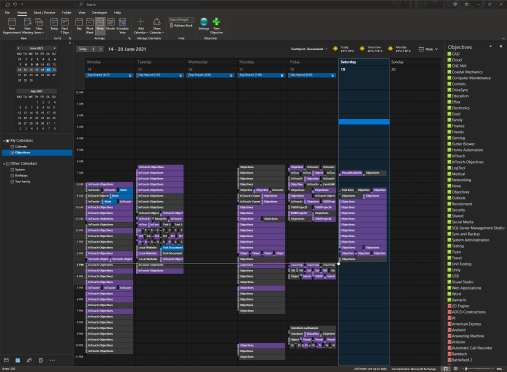

# Objectives  
This solution is a collection of projects that are used to track time and costs spend working on a range of project types. It is a work in progress and currently the ability to invoice the time tracked is being implemented. Microsoft Outlook is used as a central collection so a web server is not required and there are no uptime requirements.
  

# Projects
### AutoCAD Objectives  
###### [Overview](./AutoCADObjectives/Docs/README.md) \- [Object Model](./AutoCADObjectives/Docs/ObjectModel.md)  
Is an extension for Autodesk's AutoCAD that tracks the time spent creating or viewing AutoCAD drawing files. This is a work in progress, has not been tested on drawing sets yet.  

### Common Objectives  
###### [Overview](./CommonObjectives/Docs/README.md) \- [Object Model](./CommonObjectives/Docs/ObjectModel.md)  
Is a shared library of classes between all projects. The most commonly used are the WorkItem class and WorkType class.  

### Excel Objectives  
###### [Overview](./ExcelObjectives/Docs/README.md) \- [Object Model](./ExcelObjectives/Docs/ObjectModel.md)  
A Microsoft Excel VSTO AddIn that tracks time spent creating or reviewing Excel files of all formats. This can also include other file types such as csv files or delimited files that also open in Excel.  

### Outlook Objectives  
###### [Overview](./OutlookObjectives/Docs/README.md) \- [Object Model](./OutlookObjectives/Docs/ObjectModel.md)  
A Microsoft Outlook VSTO AddIn that is used to collect and track the time spent working. It creates several reports such as a daily, weekly and monthly report that summarize the time spent on each different Objective.  This is a work in progress, currently the ability to invoice the Objectives work is being implimented.  

### Project Objectives  
###### [Overview](./ProjectObjectives/Docs/README.md) \- [Object Model](./ProjectObjectives/Docs/ObjectModel.md)  
A Microsoft Project VSTO AddIn to track time spent on Microsoft Project files.  

### Visio Objectives  
###### [Overview](./VisioObjectives/Docs/README.md) \- [Object Model](./VisioObjectives/Docs/ObjectModel.md)  
A Microsoft Visio VSTO AddIn to track time spent on Microsoft Visio files.  

### Visual Studio Objectives  
###### [Overview](./VisualStudioObjectives/Docs/README.md) \- [Object Model](./VisualStudioObjectives/Docs/ObjectModel.md)  
A Microsoft VSIX Visual Studio Extension that tracks the time spent creating and reviewing Microsoft Visual Studio Solutions. This includes all types of projects and individual files using in Objectives.  

### Windows Objectives  
###### [Overview](./WindowsObjectives/Docs/README.md) \- [Object Model](./WindowsObjectives/Docs/ObjectModel.md)  
A .Net Framework Application that monitors windows for events.  

### Word Objectives  
###### [Overview](./WordObjectives/Docs/README.md) \- [Object Model](./WordObjectives/Docs/ObjectModel.md)  
A Microsoft Word VSTO AddIn that is used to track time spent creating or reviewing Microsoft Word documents. Just as with the Microsoft Excel AddIn, non standard file opened in Microsoft Word are also tracked.  

# Reports

### Daily Report