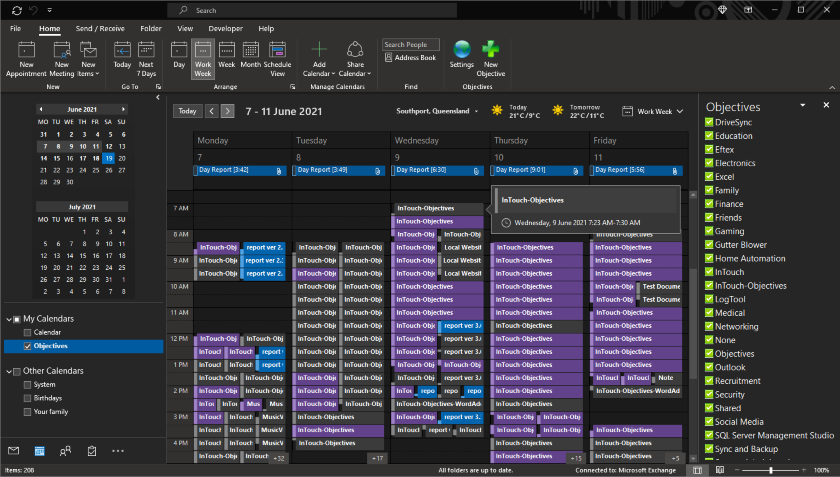
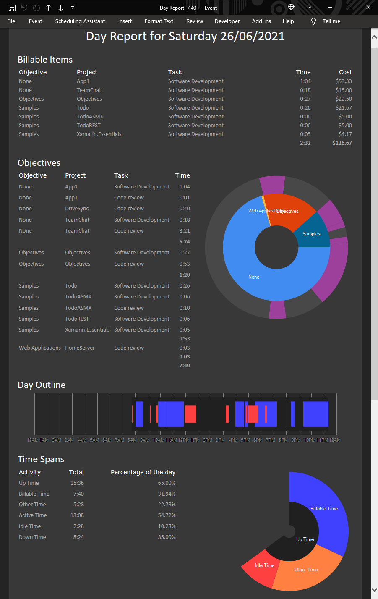

# Objectives Overview 
This solution is a collection of projects that are used to track time and costs spent working on a range of project types. It is a work in progress and currently the ability to invoice the time tracked is being implemented. Microsoft Outlook is used as a central collection so a web server is not required and there are no uptime requirements.
  

# Projects
### Android Objectives  
###### [Overview](./AndroidObjectives/Docs/README.md) \- [Object Model](./AndroidObjectives/Docs/ObjectModel.md) \- Work in Progress
Is an Xaramin Android application used to track items such as consultations, meetings and other tasks.

### AutoCAD Objectives  
###### [Overview](./AutoCADObjectives/Docs/README.md) \- [Object Model](./AutoCADObjectives/Docs/ObjectModel.md) \- Testing
Is an extension for Autodesk's AutoCAD that tracks the time spent creating or viewing AutoCAD drawing files. This is a work in progress, it has not been tested on drawing sets yet.  

### Common Objectives  
###### [Overview](./CommonObjectives/Docs/README.md) \- [Object Model](./CommonObjectives/Docs/ObjectModel.md)  
Is a shared library of classes between all projects. The most commonly used are the WorkItem class and WorkType class.  

### Excel Objectives  
###### [Overview](./ExcelObjectives/Docs/README.md) \- [Object Model](./ExcelObjectives/Docs/ObjectModel.md) \- Testing
A Microsoft Excel VSTO AddIn that tracks time spent creating or reviewing Excel files of all formats. This can also include other file types such as csv files or delimited files that also open in Excel.  

### Outlook Objectives  
###### [Overview](./OutlookObjectives/Docs/README.md) \- [Object Model](./OutlookObjectives/Docs/ObjectModel.md) \- Work in Progress
A Microsoft Outlook VSTO AddIn that is used to collect and track the time spent working. It creates several reports such as a daily, weekly and monthly report that summarize the time spent on each different Objective.  This is a work in progress, currently the ability to invoice the Objectives work is being implemented.  

### Project Objectives  
###### [Overview](./ProjectObjectives/Docs/README.md) \- [Object Model](./ProjectObjectives/Docs/ObjectModel.md) \- Work in Progress
A Microsoft Project VSTO AddIn to track time spent on Microsoft Project files.  

### Visio Objectives  
###### [Overview](./VisioObjectives/Docs/README.md) \- [Object Model](./VisioObjectives/Docs/ObjectModel.md) \- Work in Progress
A Microsoft Visio VSTO AddIn to track time spent on Microsoft Visio files.  

### Visual Studio Objectives  
###### [Overview](./VisualStudioObjectives/Docs/README.md) \- [Object Model](./VisualStudioObjectives/Docs/ObjectModel.md) \- Testing
A Microsoft VSIX Visual Studio Extension that tracks the time spent creating and reviewing Microsoft Visual Studio Solutions. This includes all types of projects and individual files using in Objectives.  

### Windows Objectives  
###### [Overview](./WindowsObjectives/Docs/README.md) \- [Object Model](./WindowsObjectives/Docs/ObjectModel.md) \- Testing
A .Net Framework Application that monitors windows for events.  

### Word Objectives  
###### [Overview](./WordObjectives/Docs/README.md) \- [Object Model](./WordObjectives/Docs/ObjectModel.md) \- Testing
A Microsoft Word VSTO AddIn that is used to track time spent creating or reviewing Microsoft Word documents. Just as with the Microsoft Excel AddIn, non standard file opened in Microsoft Word are also tracked.  

# Reports

### Daily Report
The daily report is generated once outlook starts the next day. This report has several sections.

#### Invoice Items
Is a table of items that have tasks that can be invoiced. It also contains a total of the time of these items as well as a total cost of the items.

#### Objectives
This section has a table of tasks group by their Objective and Project. This includes no cost items. To the right is a chart showing a visualization of these tasks.

#### Day Outline
This graphic shows a simple breakdown of the day showing the billable time, idle time and other time.

#### Time Spans
This table show time span totals as well as the percentage amount of the day the time span includes. These are also shown in a chart as well.

